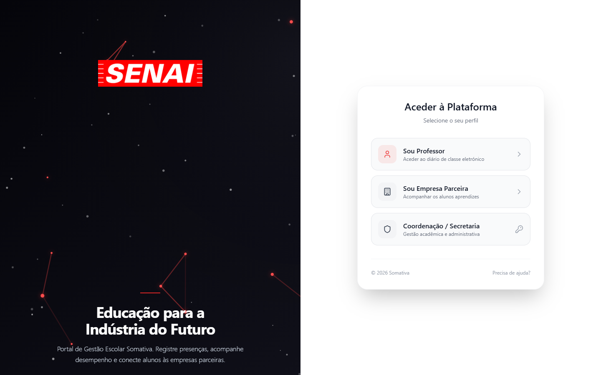
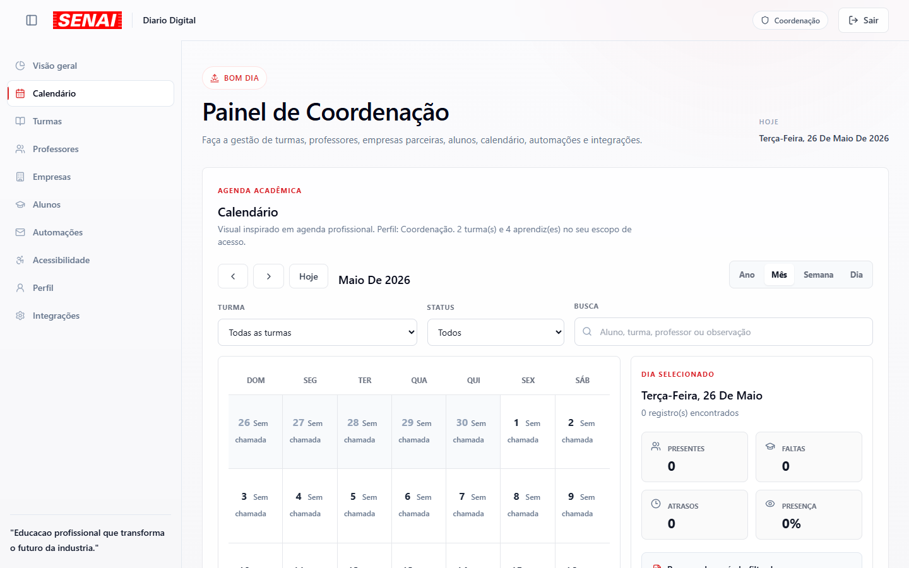
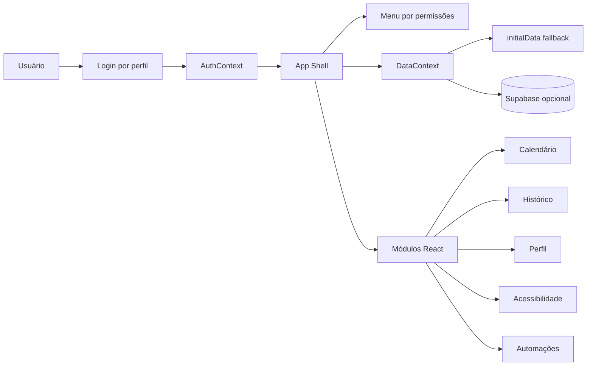
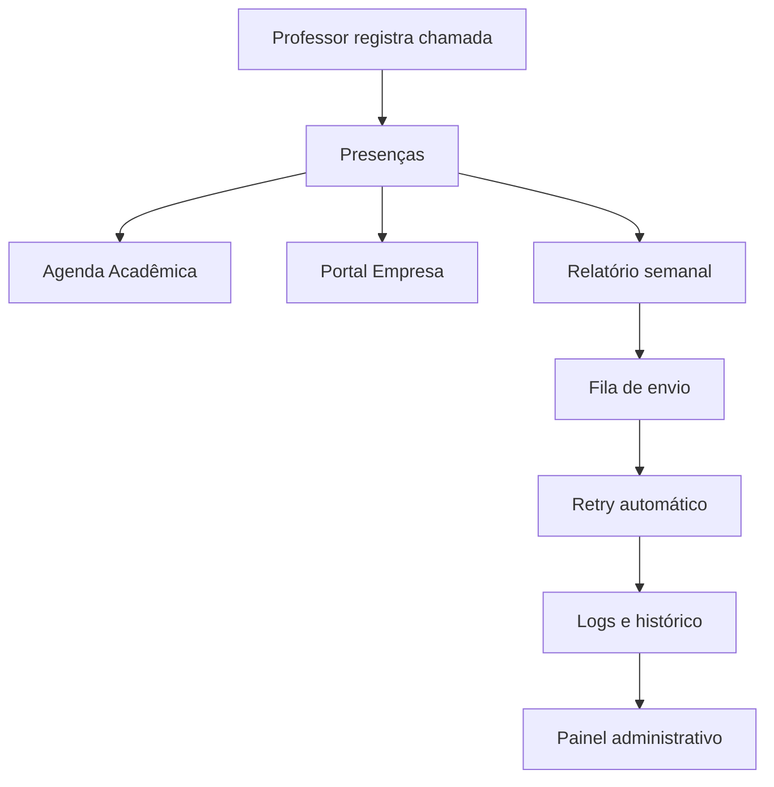

# SENAI Diário Digital


Sistema web para chamadas, presença, acompanhamento de aprendizes, calendário acadêmico, acessibilidade, automações de e-mail e gestão administrativa para unidades SENAI.

## Objetivo

Profissionalizar a gestão de frequência escolar com uma interface moderna, responsiva e preparada para uso por Coordenação, Secretaria, Professores, Empresas parceiras e TIC.

O projeto está organizado na raiz deste repositório.

## Stack

| Camada | Tecnologia |
|---|---|
| Frontend | React.js, JavaScript, Vite |
| UI | TailwindCSS via CDN, CSS modular do design system, Lucide React |
| Estado | Context API, persistência local para perfil e acessibilidade |
| Dados | Supabase opcional, fallback com dados iniciais |
| Exportação | CSV/PDF no navegador |
| Automação | Painel frontend e modelo preparado para fila/backend Node.js |

## Funcionalidades

- Dashboards por perfil com indicadores de presença, faltas e pendências.
- Chamada por turma, data e professor.
- Calendário acadêmico com visão anual, mensal, semanal e diária.
- Histórico completo por aprendiz, com percentuais, filtros, observações, justificativas e evolução mensal.
- Perfil do usuário com foto, preferências, senha, notificações, permissões e histórico de acesso.
- Módulo de acessibilidade com tema claro/escuro, alto contraste, fonte, escala, espaçamento, foco visível e preparação para Libras.
- Painel de automações de e-mail com templates, periodicidade, fila, histórico, retry e reenvio.
- Hierarquia de usuários: Coordenação, Secretaria, Professor, Empresa e TIC.
- Rota técnica oculta `/sesisenaisp72` para Login TIC protegido por token.

## Prints





## Perfis

| Perfil | Escopo | Principais permissões |
|---|---|---|
| Coordenação | Visão ampla | Dashboards, relatórios, métricas, filtros, análises e gestão completa |
| Secretaria | Administração parcial | Alunos, professores, e-mails, relatórios, planilhas e suporte acadêmico |
| Professor | Turmas vinculadas | Chamada, frequência, observações, relatórios e calendário das turmas |
| Empresa | Aprendizes vinculados | Acompanhamento, relatórios e histórico completo de presença |
| TIC | Super admin | Manutenção, reset de senhas, monitoramento, debug, permissões e visão global |

## Arquitetura





## Estrutura

```txt
Senai-diario/
  src/
    components/          # Dashboards, calendário, perfil, automações e UI
    contexts/            # Auth, dados e preferências de usuário
    data/                # Dados iniciais demonstrativos
    services/            # Supabase e automações
    styles/              # Design system e acessibilidade
    utils/               # Permissões, analytics e exportações
  supabase/schema.sql    # Schema relacional e tabelas futuras
  public/robots.txt      # Bloqueio da rota técnica
```

## Instalação

```bash
cd Senai-diario
npm install
cp .env.example .env
npm run dev
```

Aplicação local:

```txt
http://127.0.0.1:5173
```

## Variáveis

```env
VITE_SUPABASE_URL=
VITE_SUPABASE_ANON_KEY=
VITE_TIC_ACCESS_TOKEN=troque-este-token-em-producao
```

## Supabase

1. Crie um projeto Supabase.
2. Execute [`supabase/schema.sql`](./supabase/schema.sql).
3. Configure `VITE_SUPABASE_URL` e `VITE_SUPABASE_ANON_KEY`.
4. Em produção, substitua políticas abertas por RLS com autenticação real por perfil.

## Segurança

- A rota `/sesisenaisp72` é marcada como `noindex,nofollow,noarchive` e bloqueada no `robots.txt`.
- O Login TIC exige token configurável por ambiente.
- Logs de acesso TIC são registrados localmente e o schema já prevê tabela dedicada.
- Senhas e token técnico devem ser validados no backend em produção.
- `.env` e logs locais estão ignorados pelo Git.

## Automação de e-mail

Regra principal preparada: toda segunda-feira às 05:00, enviar relatório semanal para empresas com gráficos, métricas, frequência, faltas, atrasos e comparativos.

O painel administrativo já modela:

- automações;
- destinatários;
- templates reutilizáveis;
- filas;
- logs;
- retry automático;
- histórico;
- reenvio;
- ativação/desativação.

## Qualidade

```bash
npm run lint
npm run build
```

Validações realizadas nesta versão:

- build de produção;
- lint;
- navegação principal;
- permissões por perfil no menu;
- persistência local de acessibilidade/perfil;
- proteção visual e `robots.txt` da rota TIC.

## Deploy

Build:

```bash
npm run build
```

Saída:

```txt
dist/
```

Hospedagem recomendada: Vercel, Netlify, GitHub Pages com SPA fallback, ou servidor Nginx/Node.js.

## Roadmap

- Code splitting para reduzir bundle inicial.
- Backend Node.js para cron real, fila BullMQ/Redis e provedor SMTP.
- Autenticação real com RBAC no backend.
- RLS Supabase por perfil.
- Importação/exportação avançada de planilhas.
- Testes E2E com Playwright.
- Integração real com API de Libras.
- Notificações por e-mail, WhatsApp ou webhook institucional.

## Licença

Projeto proprietário. Consulte [`LICENSE`](./LICENSE).

## Créditos

Desenvolvido como solução demonstrável para gestão de presença escolar SENAI, com foco em escalabilidade, acessibilidade, UX moderna e futura comercialização.
